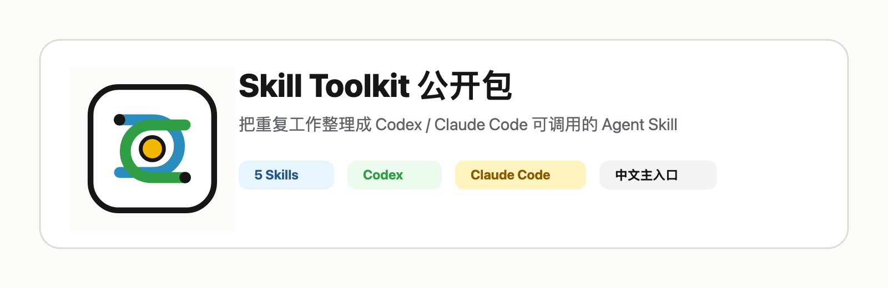
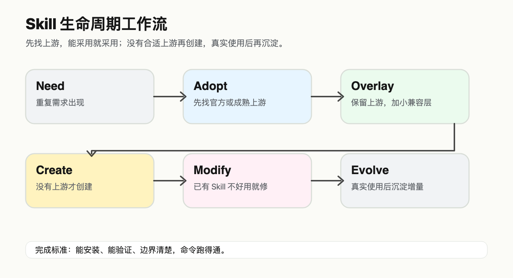
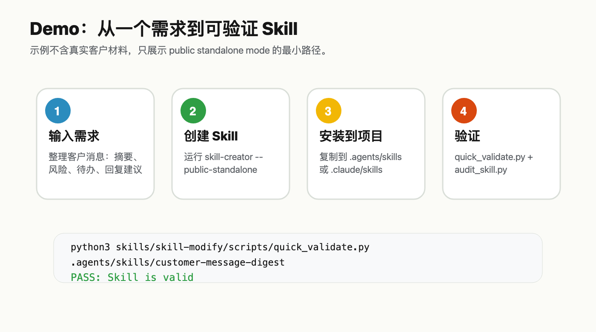

# Skill Toolkit 公开包

[English](README.en.md) · [快速安装](docs/QUICK_START.zh-CN.md) · [公开边界](docs/PUBLIC_EDITION_NOTES.zh-CN.md)


把重复工作整理成 Codex / Claude Code 可调用的 Agent Skill。

这个仓库面向看完视频后想直接上手的人。默认你是一个空系统：不需要我的内部工具链，也不需要先理解我的整套治理系统。你只需要把这 5 个 Skill 复制到自己的项目里，然后让 Codex 或 Claude Code 按需调用。

## 30 秒安装

### Codex 项目

```bash
git clone https://github.com/kun-agent-system/skill-toolkit-public.git
cd skill-toolkit-public

PROJECT=/path/to/your/project
mkdir -p "$PROJECT/.agents/skills"
cp -R skills/skill-adopter skills/skill-overlay skills/skill-creator skills/skill-modify skills/skill-evolver "$PROJECT/.agents/skills/"
```

### Claude Code 项目

```bash
git clone https://github.com/kun-agent-system/skill-toolkit-public.git
cd skill-toolkit-public

PROJECT=/path/to/your/project
mkdir -p "$PROJECT/.claude/skills"
cp -R skills/skill-adopter skills/skill-overlay skills/skill-creator skills/skill-modify skills/skill-evolver "$PROJECT/.claude/skills/"
```

建议把 `contracts/` 留在这个仓库里。只有你要用 `skill-creator` 从零生成新 Skill 时，才需要它读取这些结构约束。

## 给 Agent 的一句话

安装后，把下面这句发给 Codex 或 Claude Code：

```text
这个项目已经安装 Skill Toolkit。遇到“找现成 Skill、创建 Skill、给上游 Skill 加兼容层、修已有 Skill、把真实使用后的改进沉淀成 Skill”时，请按需调用 .agents/skills 或 .claude/skills 里的 skill-adopter、skill-overlay、skill-creator、skill-modify、skill-evolver。
```

## 包里有什么

| Skill | 什么时候用 |
|---|---|
| `skill-adopter` | 想要一个新能力时，先找官方或成熟上游，能采用就采用。 |
| `skill-overlay` | 上游 Skill 基本可用，但需要加 Codex / Claude Code 兼容层。 |
| `skill-creator` | 确认没有合适上游后，从一个能力需求创建新 Skill。 |
| `skill-modify` | 已有 Skill 不触发、误触发、太臃肿、资源漂移或缺验证。 |
| `skill-evolver` | 真实使用后，把下次还会复用的改进沉淀下来。 |

公开版只包含这 5 个 lifecycle skills。私有仓里的 `plugin-manager` 不在本期公开包里。

## Workflow



核心顺序：

1. 先找上游：不要一上来就从零写。
2. 能采用就采用：保留来源和验证。
3. 需要兼容层就 overlay：不要直接改坏上游。
4. 没有合适上游才 create。
5. 已有 Skill 不好用先 modify。
6. 真实使用证明有复用价值后再 evolve。

## Demo



示例目录：[examples/customer-message-digest](examples/customer-message-digest)

这个 demo 演示如何把“整理客户聊天记录”这类重复工作，拆成输入、输出、边界和验证命令。示例不包含真实客户材料。

## 验证

在仓库根目录运行：

```bash
python3 -m py_compile skills/skill-adopter/scripts/adopt_skill.py skills/skill-adopter/scripts/research_skill.py skills/skill-adopter/scripts/source_card_to_registry.py skills/skill-overlay/scripts/apply_overlay.py skills/skill-creator/scripts/create_skill.py skills/skill-evolver/scripts/build_patch_plan.py skills/skill-evolver/scripts/audit_incremental_update.py

for skill in skill-adopter skill-overlay skill-creator skill-modify skill-evolver; do
  python3 skills/skill-modify/scripts/quick_validate.py "skills/$skill"
  python3 skills/skill-modify/scripts/audit_skill.py "skills/$skill"
done
```

## 文档

- [快速安装与验证](docs/QUICK_START.zh-CN.md)
- [Lifecycle workflow](docs/SKILL_LIFECYCLE.zh-CN.md)
- [公开版边界说明](docs/PUBLIC_EDITION_NOTES.zh-CN.md)
- [公开仓库标准](docs/PUBLIC_REPO_STANDARD.zh-CN.md)
- [图片资产说明](assets/README.md)
- [English README](README.en.md)

## 公开边界

这个仓库不是 Kun 私有治理系统的完整公开镜像。

不包含：

- Kun 私有 registry；
- private upstream lock；
- 本机 `.agents` / `.claude` cache；
- 客户材料、凭据、内部会议材料；
- 未公开视频素材；
- `plugin-manager`。

`skill-registry.yaml` 只是本仓的 Skill 清单和安装顺序参考，不是用户安装前提。

## Star History

[](https://www.star-history.com/#kun-agent-system/skill-toolkit-public&Date)

## License

[MIT](LICENSE)
