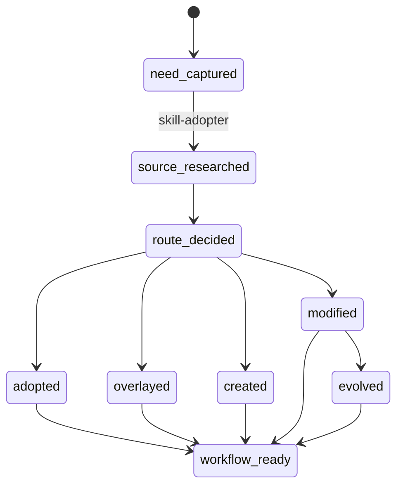

# WORKFLOW · Skill Toolkit Public Edition

workflow_id: skill-lifecycle-public
purpose: Help an Agent research, adopt, overlay, create, repair, and evolve Agent Skills with visible proof surfaces.
repo_type: composite_skill_repo
states: [need-captured, source-researched, route-decided, adopted, overlayed, created, modified, evolved, workflow-ready, blocked]
transitions: [need-captured->source-researched, source-researched->route-decided, route-decided->adopted, route-decided->overlayed, route-decided->created, route-decided->modified, modified->evolved, any->workflow-ready, any->blocked]
artifact_gates: [source card, route decision, chain contract, local lock evidence, quick_validate, audit_skill, pressure scenario]
entry_skills: [skill-adopter, skill-creator, skill-modify]
skip_rules: [skip create when adopt or overlay fits, skip overlay when upstream can be adopted raw, skip evolve without real-use or pressure-scenario evidence]
stop_states: [workflow-ready, blocked]
proof_surfaces: [quick_validate.py, audit_skill.py, source card, skills-lock.json, git diff, pressure scenario]
public_edition: true
private_registry_required: false

## State Machine

## Public Standalone Rule

Kun's private registry is not included in this repository. When it is missing, continue in public standalone mode:

- record unavailable private or local tools as evidence gaps;
- do not claim official source locks unless you have actually verified them;
- use `skills/skill-creator/scripts/create_skill.py --public-standalone` for local creation;
- use `quick_validate.py`, `audit_skill.py`, git diff, and pressure scenarios as the public proof surface.
