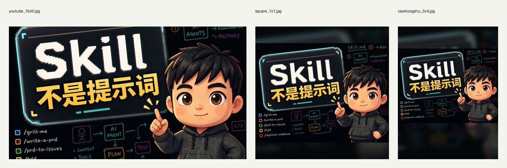

# Skill 不是提示词：本期视频资料页

本期视频讲的是 Agent Skill（智能体技能）怎么从一段规则，变成可维护的工作接口。

一句话：

> Prompt 解决这一次怎么说；Skill 解决下一次 Agent 怎么判断、查资料、调用工具和停下来。

## 视频信息

- 标题建议：`会写 Skill 还不够：关键是把它做成 Agent 的工作接口`
- 成片版本：`skill_toolkit_round15_final_16x9.mp4`
- 时长：约 8 分 49 秒
- 封面：16:9、1:1、3:4 三套
- 视频链接：`[待回填]`

## 核心概念

### Prompt

Prompt 解决一次表达。它适合临时解释背景、给模型一个方向、让模型完成一次任务。

### Skill

Skill 解决反复发生的工作流。一个好 Skill 应该说清楚：

- 什么时候触发；
- 要读哪些 references（参考资料）；
- 哪些判断交给 LLM（大语言模型）；
- 哪些机械动作交给 scripts / tools / checker（脚本、工具、检查器）；
- 什么情况下必须停下来等人确认。

### Plugin

Plugin（插件）适合组织一组相关能力，尤其是需要 MCP、OAuth、浏览器桥接、后台服务、授权或宿主集成时。不要一上来就把一个小流程做成 Plugin。

## 本仓库里的资料

- `skills/video-publish-copy-pack/`：一个可公开阅读的 Skill 样例。
- `examples/publish-copy-spine.skill-toolkit-round15.yaml`：本期视频的统一表达主干。
- `examples/publish-copy-pack.skill-toolkit-round15.md`：本期视频的多平台文案包。
- `docs/SKILL_DESIGN_NOTES.zh-CN.md`：从 prompt 到 Skill 的设计笔记。
- `docs/AGENT_INSTALL_PROMPT.zh-CN.md`：让另一个 Agent 阅读本仓库并使用样例 Skill 的提示词。

## 普通人怎么开始

先找一个你反复返工的小场景，不要从大插件开始。

可以问五个问题：

1. 这件事是不是反复发生？
2. 它有没有稳定判断顺序？
3. 它需要哪些参考资料？
4. 哪些步骤可以机械验证？
5. 缺资料或要外部操作时，Agent 应该在哪里停？

如果这五个问题能回答清楚，就可以先写一个小 Skill。

## 链接区

- 视频链接：`[待回填]`
- B 站：`[待回填]`
- YouTube：`[待回填]`
- 小红书：`[待回填]`
- 飞书资料页：`[待回填]`

