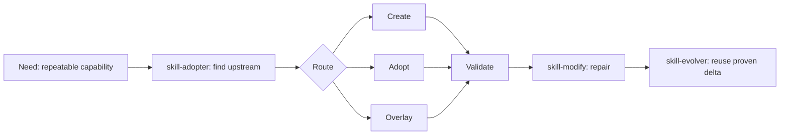

# 视觉资产方案

状态：`needs-review`

这份方案列出准备放进 public repo 的视频、Workflow 图、Demo 和 GIF。最终媒体文件先不提交，等 Kun 看过方案后再生成或拷入。

## 资产清单

| 资产 | 建议路径 | 用途 | 来源 | 状态 |
|---|---|---|---|---|
| Workflow 图 | `assets/workflow/skill-lifecycle-workflow.png` | README 首屏和 docs 中解释五个 lifecycle skills 的关系 | 根据 `WORKFLOW.md` 重新绘制 | `needs-review` |
| Mermaid 源文件 | `assets/workflow/skill-lifecycle-workflow.mmd` | 保留可维护源文件 | 从 `WORKFLOW.md` state machine 抽取 | `needs-review` |
| Demo 录屏 GIF | `assets/demo/customer-message-digest-demo.gif` | 展示 public standalone mode 从需求到 skill 验证的流程 | 使用 demo 目录重新录制，不含真实客户材料 | `needs-review` |
| 视频片段入口图 | `assets/video/skill-toolkit-video-cover.jpg` | README 链接视频时使用 | 使用已公开或待公开视频封面 | `needs-review` |
| 视频片段说明 | `assets/video/README.md` | 说明视频素材来源、授权和对应章节 | 根据公开视频发布信息整理 | `needs-review` |

## 推荐 Workflow 图结构

## Demo 脚本

Demo 使用 `examples/customer-message-digest`，展示一个公开安全流程：

1. 读 demo 的输入、输出、边界和验证要求。
2. 调用 `skill-creator --public-standalone` 生成示例 Skill。
3. 跑 `quick_validate.py` 和 `audit_skill.py`。
4. 展示生成后的 `SKILL.md` 关键段落。

不使用真实聊天记录；输入用短示例文本。

## Review 问题

- Workflow 图是否要偏教程风，还是偏 GitHub README 简洁图。
- GIF 是否直接放 README 首屏，还是放 docs/demo 页面。
- 视频封面是否使用本期视频最终封面，还是用单独的仓库封面图。
- assets 目录是否接受二进制图片/GIF，还是只保留 Mermaid 源和外链。
