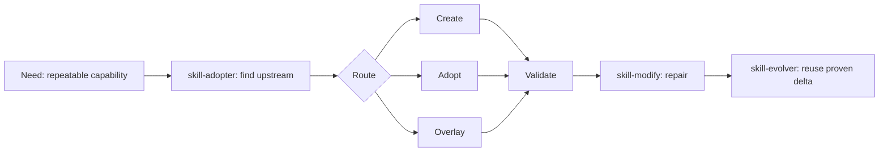

# 图片资产方案

状态：`implemented`

这份方案原本用于列出准备放进 public repo 的视觉资产。当前执行范围已收敛为图片资产：不做视频资产，不做 GIF。

## 资产清单

| 资产 | 路径 | 用途 | 来源 | 状态 |
|---|---|---|---|---|
| Logo | `assets/brand/logo.png` / `.svg` | 仓库识别图 | 本地脚本生成 | `done` |
| Banner | `assets/brand/banner.png` / `.svg` | README 首屏 | 本地脚本生成 | `done` |
| Social preview | `assets/brand/social-preview.png` / `.svg` | GitHub 社交预览候选图 | 本地脚本生成 | `done` |
| Workflow 图 | `assets/workflow/skill-lifecycle-workflow.png` / `.svg` | README 中解释五个 lifecycle skills 的关系 | 本地脚本生成 | `done` |
| Mermaid 源文件 | `assets/workflow/skill-lifecycle-workflow.mmd` | 保留可维护源文件 | 从 workflow 结构抽取 | `done` |
| Demo 图 | `assets/demo/customer-message-digest-demo.png` / `.svg` | 展示 public standalone mode 的最小路径 | 本地脚本生成 | `done` |

## 推荐 Workflow 图结构

## Demo 脚本

Demo 使用 `examples/customer-message-digest`，展示一个公开安全流程：

1. 读 demo 的输入、输出、边界和验证要求。
2. 调用 `skill-creator --public-standalone` 生成示例 Skill。
3. 跑 `quick_validate.py` 和 `audit_skill.py`。
4. 展示生成后的 `SKILL.md` 关键段落。

不使用真实聊天记录；输入用短示例文本。

## Review 问题

- 当前版本采用 GitHub README 简洁图。
- 当前版本不做 GIF。
- 当前版本不放视频封面。
- assets 目录同时保留 SVG 源和 PNG 渲染图。
